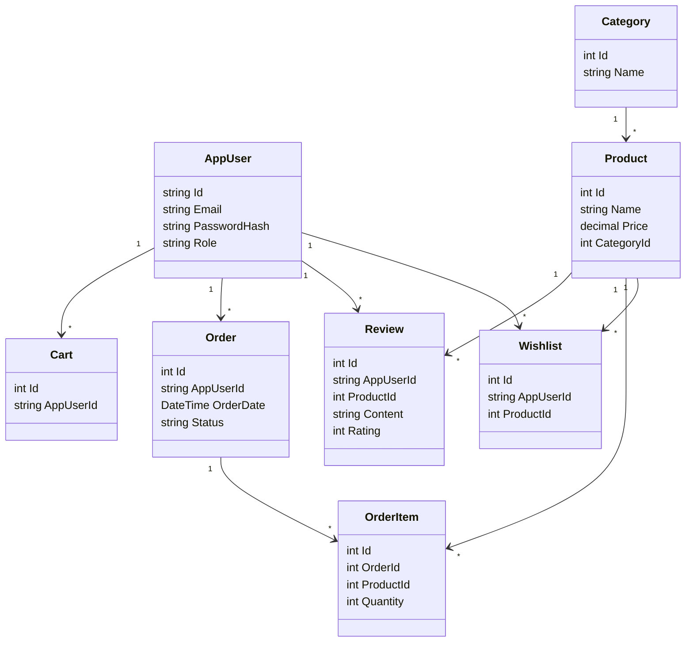

# E-Commerce Platform (Angular & ASP.NET Core)

A full-stack e-commerce platform enabling customers to browse, purchase, and review products with robust order management, wishlists, real-time cart updates, and secure authentication. Designed for scalability, real-time responsiveness, and ease of use.

---

## 🚀 Key Features

### 👤 User Roles
- **Customers**: Register/login, browse products, manage carts/wishlists, place orders, write reviews  
- **Admins**: Manage products, categories, view orders, and moderate reviews  

### 🛒 Core Functionalities
- **Product Management**
  - Browse by category  
  - View product details and reviews  
  - Add to cart or wishlist  

- **Cart & Checkout**
  - Add/remove items in real-time  
  - Cart persistence  
  - Place orders with multiple items  

- **Order System**
  - View past orders  
  - Track order status  
  - Admin overview  

- **User Features**
  - Product reviews with ratings  
  - Wishlist management  
  - Profile view and updates  

- **Security**
  - Cookies-based authentication  
  - Angular HTTP interceptors for token injection and error handling  
  - Protected admin routes  

---

## 🧱 Tech Stack

### Frontend
- **Angular 15+** (TypeScript)  
- **PrimeNG** UI components  
- **RxJS** for reactive state  
- **HTTP Interceptors** for token & error handling  

### Backend
- **ASP.NET Core 8** Web API  
- **Entity Framework Core** with SQL Server  
- **Cookies Authentication & Role Authorization**  
- **RESTful APIs** with DTOs and clean separation of concerns  

---

## 📁 Project Structure

### 🔌 API Controllers

| Area         | Controllers                                    |
|--------------|------------------------------------------------|
| AppUsers     | `AccountController`                            |
| Products     | `ProductController`, `CategoryController`      |
| Orders       | `OrderController`, `OrderItemController`       |
| Cart         | `CartController`                               |
| Wishlist     | `WishlistController`                           |
| Reviews      | `ReviewController`                             |

---

## 🧩 Entity Relationship Diagram


## Required Tools and Technologies

This project requires the following tools and technologies:

- **Visual Studio 2022**: The recommended Integrated Development Environment (IDE) for this project, providing full support for .NET 8.0 and additional tools like scaffolding and debugging.
- **.NET 8.0 SDK**: The project is built using the .NET 8.0 framework, which must be installed for development and running the application.
- **SQL Server**: A relational database system used to store the forum data, including user information, posts, and comments.
- **Angular 19**


### NuGet Packages  

- **Google.Apis.Auth.AspNetCore3 (1.69.0)** - Enables Google authentication in ASP.NET Core applications.  
- **MailKit (4.10.0)** - A cross-platform mail client library for sending and receiving emails.  
- **Microsoft.AspNetCore.Authentication.Facebook (8.0.13)** - Handles Facebook authentication in ASP.NET Core applications.  
- **Microsoft.AspNetCore.Authentication.Google (8.0.13)** - Manages Google authentication in ASP.NET Core applications.  
- **Microsoft.AspNetCore.Identity.EntityFrameworkCore (8.0.0)** - Integrates ASP.NET Core Identity with Entity Framework Core for user management.  
- **Microsoft.EntityFrameworkCore (8.0.13)** - Provides Object-Relational Mapping (ORM) to interact with databases.  
- **Microsoft.EntityFrameworkCore.Design (8.0.13)** - Supports design-time tools for Entity Framework Core.  
- **Microsoft.EntityFrameworkCore.SqlServer (8.0.0)** - Enables Entity Framework Core to work with SQL Server databases.  
- **Microsoft.EntityFrameworkCore.Tools (8.0.0)** - Provides command-line tools for Entity Framework Core.  
- **Microsoft.Owin.Security.Google (42.2)** - Supports Google authentication in OWIN-based applications.  
- **Microsoft.VisualStudio.Web.CodeGeneration.Design (8.0.7)** - Facilitates code generation in ASP.NET Core projects.  
- **MimeKit (4.10.0)** - A library for parsing and creating MIME messages.  
- **Stripe.net (47.4.0)** - A .NET client for the Stripe API, enabling payment processing.  
## Configuration

Add these to your `appsettings.json`:

```json
"Stripe": {
  "SecretKey": "your_stripe_secret_key",
  "PublishableKey": "your_stripe_publishable_key"
},
"Authentication": {
  "Google": {
    "ClientId": "your_google_client_id",
    "ClientSecret": "your_google_client_secret"
  },
  "Facebook": {
    "AppId": "your_facebook_app_id",
    "AppSecret": "your_facebook_app_secret"
  }
}

